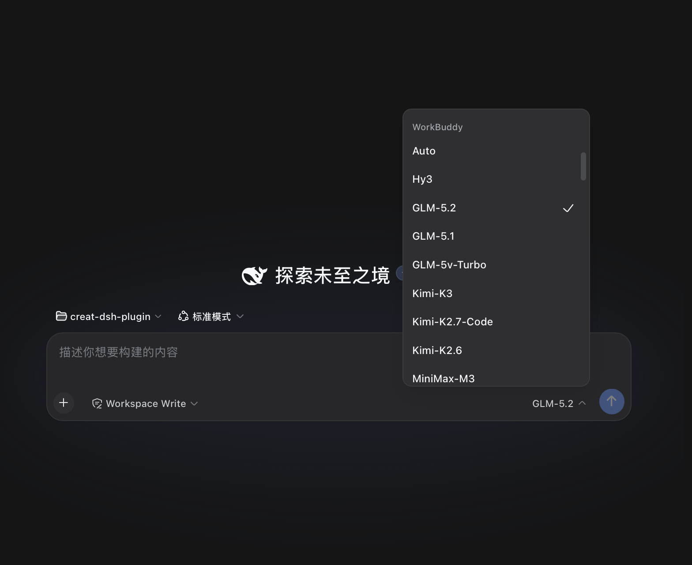
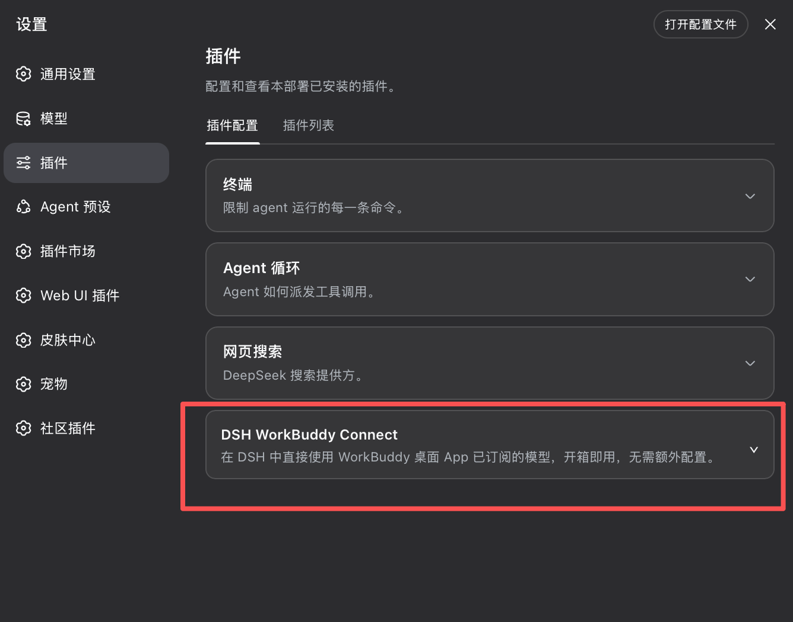
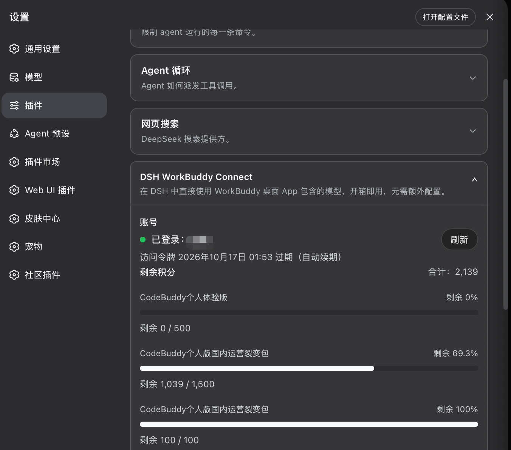

# DSH WorkBuddy Connect

English | [中文](./README.md)

Brings every model in the WorkBuddy desktop app (GLM-5.3, GLM-5.2, DeepSeek-V4-Pro, DeepSeek-V4-Flash, Kimi-K3, MiniMax-M3, Hy3, and more) straight into [DeepSeek Harness](https://github.com/deepseek-ai/deepseek-harness) — zero configuration in the DSH chat.

## Features

- **Works out of the box**: install and enable the plugin, then use it directly in DSH — no extra configuration.



- **Info at a glance**: Settings → Plugins → DSH WorkBuddy Connect card



Expand the card to see the account, token validity, and remaining credit.



## Install

Prerequisite: the WorkBuddy desktop app is installed and signed in (the plugin reuses the app's sign-in state and follows account switches automatically).

```sh
# npm (recommended; ships prebuilt artifacts)
dsh plugin --profile web add dsh-workbuddy-connect

# or install from the GitHub source
dsh plugin --profile web add github:corrinehu/dsh-workbuddy-connect

dsh web
```

## CLI

`dsh plugin --profile web exec dsh-workbuddy-connect status`: sign-in state and remaining credit (`--json` for machine-readable output; `doctor` for diagnostics and `logout` for credential cleanup are also available).

## Known limitations

- Verified on macOS with the DSH Web profile (`0.1.1-rc.2`+, Node 22+). The default credential paths on Windows / Linux are unverified — point the `WORKBUDDY_AUTH_FILE` environment variable at the actual location if needed.
- Relies on WorkBuddy client interfaces (not a public API); the plugin may need updates as WorkBuddy changes.

## Disclaimer

- This project is for **personal learning and research only**, driving your own WorkBuddy account on your own machine. Do not use it commercially or beyond reasonable personal use.
- Users must comply with the WorkBuddy terms of service. Any consequence of using this project (including but not limited to account restrictions, depleted credit, or service interruption) is borne by the user.
- The author is not liable for any direct or indirect loss arising from the use or misuse of this project.
- This project is not affiliated with, endorsed by, or sponsored by Tencent, WorkBuddy, or DeepSeek. Product names are used for compatibility description only; trademarks belong to their respective owners.

## Acknowledgements

- [Sliverkiss/workbuddy2api](https://github.com/Sliverkiss/workbuddy2api) (MIT) — reference implementation of the WorkBuddy upstream protocol.
- [franksong2702/dsh-codex-connect](https://github.com/franksong2702/dsh-codex-connect) (Apache-2.0) — reference for the DSH plugin structure and provider registration.

## License

[MIT](./LICENSE)
